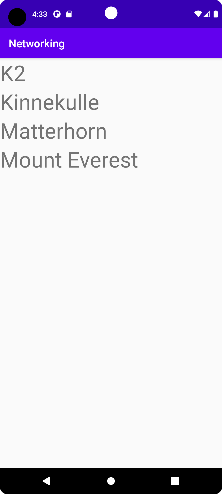

# Rapport

**Det första problemet löstes genom att lägga till en recyclerview i mitt project genom att implementera lite kod i activity_main filen
samt genom att skapa en ny XML fil och ett nytt java fil för adaptern, koden finns i kodsnippet. Det andra problemet löstes genom att lägga
till ArrayList<Mountain> och RecyclerView.Adapter som medlems variabler i mainActivity och det genomfördes genom att skriva lite kod, finns
tillgänglig ner i beskrivningen. Det tredje problemet löstes som sagt genom att skapa en recyclerViewAdapter och implementera recyclerView.ViewHolder,
koden för det kan hittas lite ner. Det fjärde problemet löstes genom att hämta url för hemsidan med json data och lägga till det i mainActivity
och därefter skriva lite kod i onPostExecute och det hanterades genom att prova fram och tillbaka mycket med kod och hur det skulle funka
samt att problemet har många lösningar och lösningen som tillämpades här var att använda gson för att omvandla json datan till en lista av
objekter vilket gjordes och visa sig fungera. Det sista problemet löstes genom att overrida toString metoden i Mountain klassen och lägga till några
rader av kod i MainActivity och därefter var det löst.**

```
    <androidx.recyclerview.widget.RecyclerView
        android:id="@+id/recycler_view"
        android:layout_width="match_parent"
        android:layout_height="match_parent"
        app:layout_constraintBottom_toBottomOf="parent"
        app:layout_constraintLeft_toLeftOf="parent"
        app:layout_constraintRight_toRightOf="parent"
        app:layout_constraintTop_toTopOf="parent" />

    mountainArrayList = new ArrayList<>();
    RecyclerViewAdapter adapter = new RecyclerViewAdapter(mountainArrayList);

    public class ViewHolder extends RecyclerView.ViewHolder {
        private TextView id_text, name_text;
        public ViewHolder(View view) {
            super(view);
            name_text = (TextView) view.findViewById(R.id.nameText);
        }
    }
    
    Gson gson = new Gson();
    Type type = new TypeToken<ArrayList<Mountain>>(){}.getType();
    ArrayList<Mountain> mountainArrayList = gson.fromJson(json, type);

    RecyclerViewAdapter adapter = new RecyclerViewAdapter(mountainArrayList);
    RecyclerView.LayoutManager layoutManager = new LinearLayoutManager(getApplicationContext());
    recyclerView.setLayoutManager(layoutManager);
    recyclerView.setAdapter(adapter);
    adapter.notifyDataSetChanged();
    
    @NonNull
    @Override
    public String toString() { return name; }
```

Bilder läggs i samma mapp som markdown-filen.



Läs gärna:

- Boulos, M.N.K., Warren, J., Gong, J. & Yue, P. (2010) Web GIS in practice VIII: HTML5 and the canvas element for interactive online mapping. International journal of health geographics 9, 14. Shin, Y. &
- Wunsche, B.C. (2013) A smartphone-based golf simulation exercise game for supporting arthritis patients. 2013 28th International Conference of Image and Vision Computing New Zealand (IVCNZ), IEEE, pp. 459–464.
- Wohlin, C., Runeson, P., Höst, M., Ohlsson, M.C., Regnell, B., Wesslén, A. (2012) Experimentation in Software Engineering, Berlin, Heidelberg: Springer Berlin Heidelberg.
